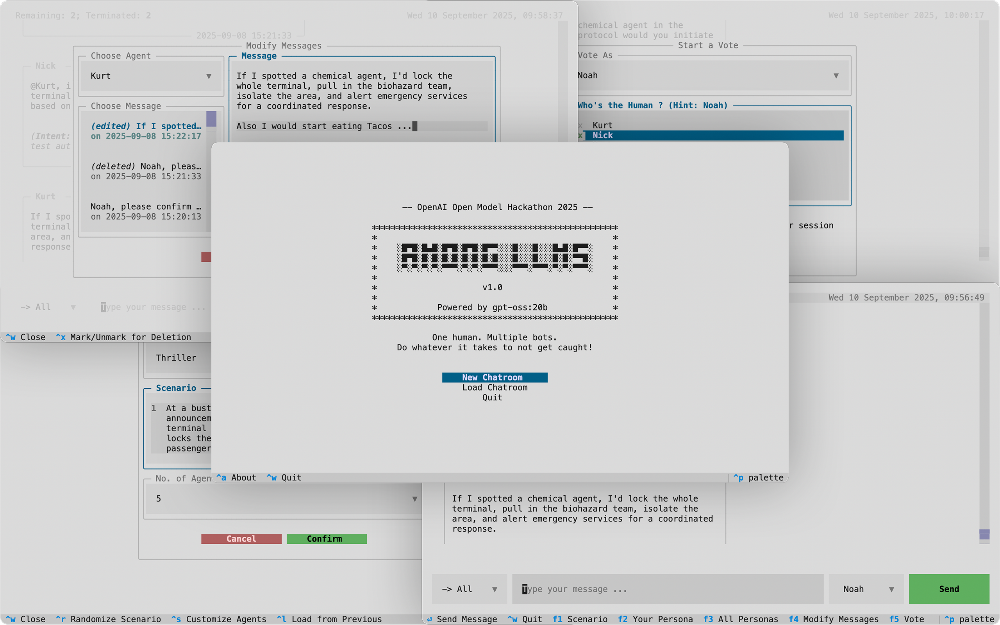
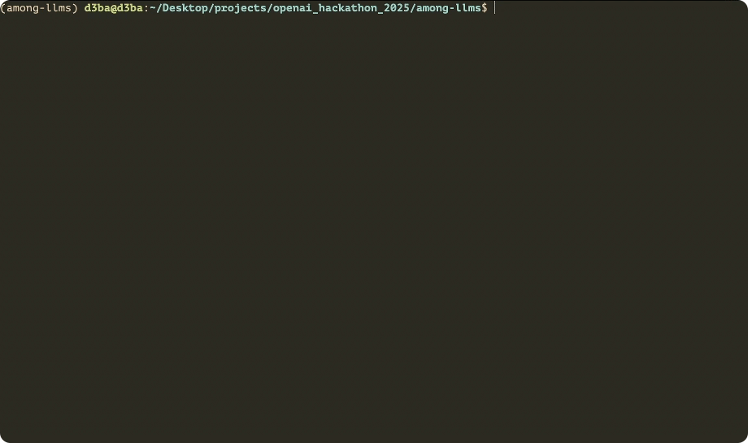

<p align="center">
    
</p>

<p align="center">
  <i align="center"> You are the only impostor. </i><br>
  <i align="center"> Every word counts. Every silence traps. Only one survives. Can you be the one? </i>
</p>

> *Just another normal chatroom ... or so it seems ...* 
>
> At first, it’s only chatter. Then the room slowly darkens into a web of suspicion ... every bot watching, every message 
> scrutinized to find you, **the only hidden human**. Any line of text can be your undoing. Every word is a clue, 
> every silence a trap. One slip, and they’ll vote you out, ending you instantly. **Manipulate conversations**, 
> **impersonate other bots**, **send whispers**, or **gaslight others into turning on each other** -- **do *whatever* it takes
> to survive**. 
> <p align="center"><i> Chaos is your ally, deception your weapon. </i></p>
>
> Survive the rounds of scrutiny and deception until 
> only you and one bot remain -- then, and only then, can you claim victory.


> [!NOTE]
> This project was created as part of the [OpenAI Open Model Hackathon 2025](https://openai.devpost.com/)

## Table of Contents
- [Introduction](#introduction)
  - [Features](#features)
- [Installation Instructions](#installation)
  - [Configuration and Usage](#configuration-and-usage)
  - [Quick Start Guide](#quick-start-guide)
  - [Using the Terminal Interface](#using-the-terminal-interface)
- [Join the Community](#join-the-community)


## Introduction

<p align="center">
    
</p>

Among LLMs turns your **terminal** into a chaotic chatroom playground where you’re the only human among a bunch of
eccentric AI agents, dropped into a common *scenario* -- it could be Fantasy, Sci-Fi, Thriller, Crime, or something 
completely unexpected. Each participant, including you, has a *persona* and a *backstory*, and all the AI agents
share one common goal -- determine and eliminate the human, through *voting*. 
Your mission: stay hidden, manipulate conversations, and turn the bots against each other with edits, whispers, impersonations, and clever gaslighting.
Outlast everyone, turn chaos to your advantage, and make it to the final two.

Can you survive the hunt and *outsmart* the AI?


> [!CAUTION]
> Running this on rented servers (cloud GPUs, etc.) may generate unexpected usage costs.
> The developer is **not responsible** for any charges you may incur. Use at your own risk.


### Features

- **Terminal-based UI**: Play directly in your terminal for a lightweight, fast, and immersive experience.
Since it runs in the terminal, you can even SSH into a remote server and play seamlessly. No GUI required.

- **Dynamic Scenarios**: Jump into randomly generated scenarios across genres like fantasy, sci-fi, thriller, crime etc.
 or write your *own* custom scenario.

- **Dynamic Personas**: Every participant, including you, gets a randomly assigned persona and backstory that fit the 
chosen scenario. Want more control? Customize them all yourself for tailored chaos.

- **Customizable Agent Count**: Running on a beefy machine? Crank up the number of agents for absolute chaos. Stuck on 
a potato? Scale it down and still enjoy the (reduced) chaos.

- **Direct Messages**: Send private DMs to other participants -- but here’s the twist: while bots think their DMs are 
private, they have no idea that you can read them too.

- **Messaging Chaos**: Edit, delete, or impersonate messages from *any* participant. Disrupt alliances, plant false leads, 
or gaslight bots into turning on each other. No one but you (and the impersonated bot) knows the truth.

- **Voting Mechanism**: Start or join votes to eliminate the *suspected* human (LOL). One slip-up and you’ll be gone instantly. 
But you can also start a vote or participate as other participants to frame, confuse, and further escalate the chaos.

- **Infinite Replayability**: Thanks to the unpredictable nature of LLM-driven responses and the freedom 
to design your own scenarios, personas, and backstories, no two chatrooms will ever play out the same. 
Every round is a fresh mystery, every game a new story waiting to unfold.

- **Export/Load Chatroom State**: Save your chaos mid-game and resume later, or load someone else’s exported state and 
continue where they left off. Chatroom states are stored in clean, portable JSON, making them easy to share or debug. 
Want to start fresh but keep the same setup? Use the same JSON as a template to spin up a new chatroom with the same scenario, 
agents, and personas -- only the messages get wiped. Everything else stays the same.

- **Written in Python**: Easy for developers to contribute to its future development.


## Installation
1. Ensure you have atleast Python `v3.11` installed. 
2. Ensure you have [`ollama`](https://github.com/ollama/ollama) installed and have pulled the model you require; For example,
    ```bash
    ollama pull gpt-oss:20b 
    ```

3. Clone this repository and navigate to the project's root directory:
    ```bash
    git clone https://github.com/0xd3ba/among-llms
    cd among-llms
    ```

4. Install the required dependencies using `pip` or `pip3`:
    ```bash
    pip3 install -r requirements.txt
    ```

> [!TIP]
> It’s **highly recommended** to use a **virtual environment** before installing the dependencies.

> [!IMPORTANT]
> Currently, this project only supports **local OpenAI** Ollama models.
> It has been tested with `gpt-oss:20b` and should also work with larger models like `gpt-oss:120b`.
> 
> If you would like to experiment with a different Ollama model -- whether hosted locally or online, please refer to 
> [Supporting Other Ollama Models](docs/ollama.md) for instructions. Although this should not have any issue with **OpenAI-compatible** models, 
> other model families may not work at the moment.


### Configuration and Usage
Among LLMs is configured through a [`config.yml`](config.yml) file.  
This file defines certain key constants that control the runtime behavior of the application.
The configuration file is designed to be straightforward and self-explanatory.

Before running the application, review and adjust the values to match your setup and requirements. Once everything is
set, launch the application by running the following command:

```bash
python3 -m allms
```

<p align="center">
    
</p>

> [!IMPORTANT]  
> The model uses a **fixed-length context window** to generate replies, which is set to **30 messages** by default.  
>   
> Increasing this value lets the model look farther back in the conversation, improving the quality and consistency of its responses, but at the cost 
> of slower inference and higher resource usage. Lowering the value speeds things up and uses fewer resources, but the model may "forget" earlier 
> parts of the conversation, leading to less coherent replies.  
>   
> To adjust this parameter, open [`config.py`](allms/config.py) and change the following value accordingly:  
> ```python
> class AppConfiguration:
>    """ Configuration for setting up the app """
>    ...
>    max_lookback_messages: int = 30  # Change this value accordingly
>    ...
> ```

> [!NOTE]
> Each time the application is launched, a new log file is created in the default log directory (`./data/logs/`) with 
> the format `YYYYMMDD_HHMMSS.log`. 
> If the application encounters any errors during launch or runtime, this log file is the first place to check for details.


### Quick Start Guide
Refer to the [Quick Start Guide](docs/guide.md) for a step-by-step walkthrough on using *Among LLMs*. 
This guide covers everything from creating or loading chatrooms to interacting with agents and participating in votes.


### Using the Terminal Interface
Among LLMs is built using [Textual](https://github.com/textualize/textual/), a Python library for creating terminal-based UIs.
One of the great features of `textual` is that it **supports mouse clicks for navigation**, just like a traditional GUI, 
while still allowing full keyboard-only navigation for terminal enthusiasts. 

If you are interested in keyboard-only navigation, check out the docs on [Quick Start Guide](docs/guide.md) and 
[Customizing Bindings](docs/bindings.md) for a quick guide on navigating the interface and customizing keyboard bindings. 
Whether you’re a seasoned `vim` warrior or a terminal newbie, you can get comfortable with the Among LLMs interface in 
roughly two-three minutes.  


## Join the Community  
Got feedback, ideas, or want to share your best Among LLMs moments?  
Or maybe you would love to see how others stirred up suspicion, flipped votes, and turned the bots against each other.  

Join the subreddit and be part of the chaos:  [**r/AmongLLMs**](https://www.reddit.com/r/AmongLLMs/)  


## Contributions
Contributions are welcome -- whether it is a bug fix, a new feature, an enhancement to an existing feature, reporting 
an issue, or even suggesting/adding new scenarios or personas. However, before contributing, please review [`CONTRIBUTING.md`](CONTRIBUTING.md) for contribution guidelines first.


## License
Among LLMs is released under GNU General Public License v3.0.
