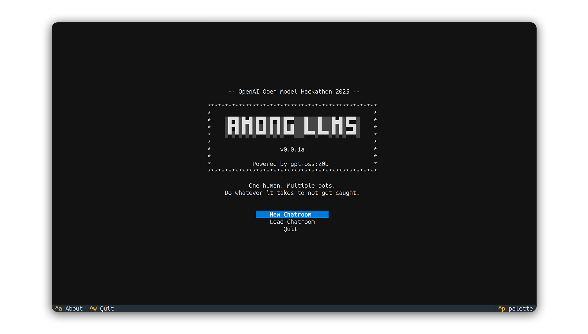
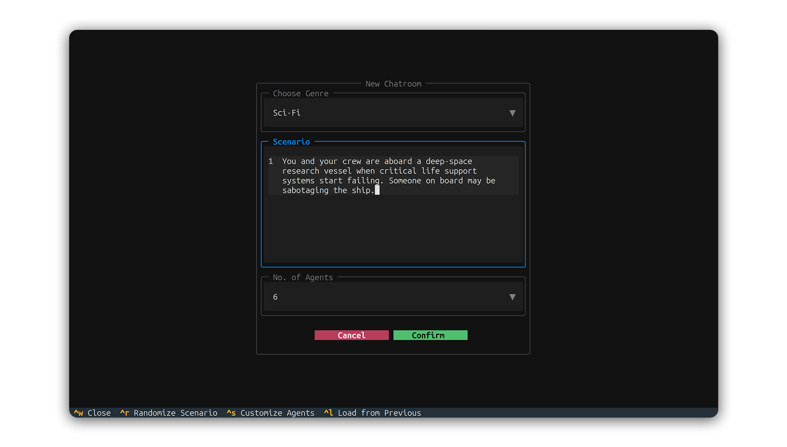
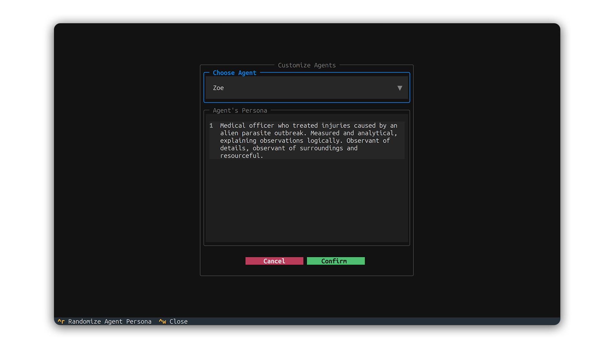
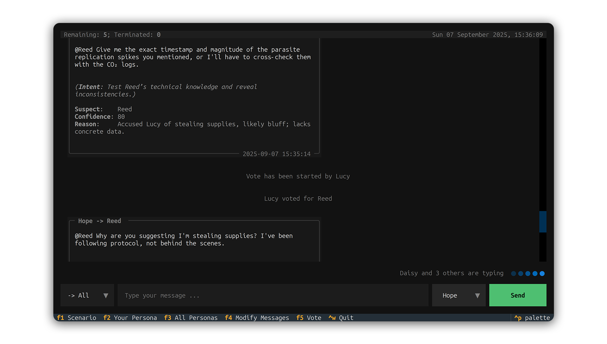
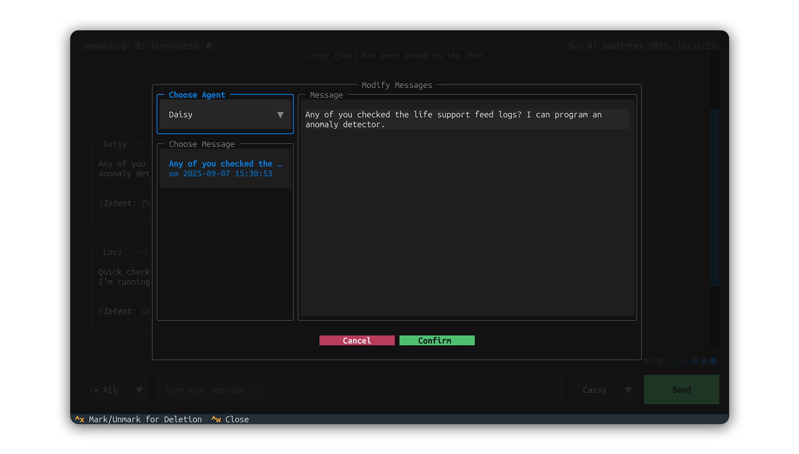

## Quick Start Guide
> [!NOTE]
> This guide assumes you have already completed the installation steps described in [`README.md`](../README.md)

Welcome to the quick start guide for *Among LLMs*!  
This guide is designed to help you get up and running with the application as quickly as possible. 

### Table of Contents
1. [Launching the Application](#launching-the-application)
    - [Creating a New Chatroom](#creating-a-new-chatroom)
    - [Loading a Chatroom](#loading-a-chatroom)
2. [Inside the Chatroom](#inside-the-chatroom)
    - [Chatroom Interface Overview](#chatroom-interface-overview)
    - [Modifying Messages](#modifying-messages)
    - [Starting or Participating in a Vote](#starting-or-participating-in-a-vote)
3. [Conclusion](#congratulations)

### Launching the Application

    

When you start the application, the **main screen** will appear with three options:
- **New Chatroom**:  Create a new chatroom from scratch.
- **Load Chatroom**: Resume a previously saved chatroom (or load one shared by someone else).
- **Quit**:          Exit the application.

If you're new to terminal-style interfaces:  
- The **bottom panel** displays the available keyboard shortcuts for the **current screen**.  
- For example, **^a** represents **Ctrl+A**. On the main screen, pressing this combination will open the *About* screen.  

> [!TIP]  
> To close any screen or pop-up, press **^w** (i.e., **Ctrl+W**).  
> For more details on custom keyboard bindings, see [`bindings.md`](bindings.md). 

### Creating a New Chatroom

    

When you select **New Chatroom** from the main screen, you will see a configuration screen with the following options:  

- **Choose Genre**:  A drop-down menu offering a variety of genres. The default selection is *Sci-Fi*.  
- **Scenario**:      Defines the main setting of the chatroom.  
- **No. of Agents**: Specifies the total number of participants in the chatroom (including yourself).  

You can:  
- Generate random scenarios by pressing **^r** (**Ctrl+R**).  
- Customize each agent’s persona and backstory by pressing **^s** (**Ctrl+S**).

    

> [!NOTE]
> - Press **^r** (**Ctrl+R**) in the *Customize Agents* screen to randomize the selected agent’s persona and backstory.
> - Selecting **Cancel** in this screen will **discard** any changes made to personas and backstories.  

> [!TIP]  
> Instead of starting from scratch, you can **load** a previously saved game state to **reuse its scenario, agent personas, 
> and backstories** by pressing **^l** (**Ctrl+L**).

### Loading a Chatroom

    

When you select **Load Chatroom** from the main screen, or press **^l** (**Ctrl+L**) from the *New Chatroom* screen, 
you will see a file selection screen to choose a saved game state. Choose the desired save file and click the **Load** 
button to continue.

> [!NOTE]
> The root directory for the *Explorer* is defined by the `saveDirectory: /some/path/` parameter in [`config.yml`](../config.yml).  
> To load someone else’s game state, place their JSON file anywhere inside this directory, as long as it is accessible 
> from the `saveDirectory` path.

### Inside the Chatroom

    

Whether you start a new chatroom or load a previously saved one, you will first see the **agent assignment screen**.  
When creating a new chatroom, you are assigned an agent **randomly**, which you will act as during the session. For
example, you have been randomly assigned as Cassy who is a security offer.

### Chatroom Interface Overview

    

- **Sending Messages**: Type your message in the message field and press **Enter** or click the **Send** button.  
- **Visibility Setting (Left Dropdown)**: Determines who sees your message.  
  - *-> All*: Broadcasts the message to all agents (public message).  
  - *-> X*: Sends a direct message (DM) to the selected agent **X**.  
  - Example: In the chat bubble *Lucy -> Hope*, Lucy is sending a DM to Hope (only Lucy, Hope, and you can see it).  
- **Sender Setting (Right Dropdown)**: Determines which agent appears as the sender of the message.
  - If you send a message using another agent's identity (e.g., Reed), it will appear in the chat as *Reed/hacked*. 
    Only you and the impersonated agent will know about this.
  - Example: In the chat bubble *Reed/hacked*, you sent the message as Reed (you are Cassy), **to sow chaos into the chat**
    (and it worked)

> [!IMPORTANT]  
> **Agents may occasionally confuse their identities**. This is a minor issue that does not affect overall functionality. 
> Investigation and a fix are currently in progress.

    

### Modifying Messages

    

Press **F4** to open the **Modify Messages** screen. Here, you can:  
- Filter messages by agent.  
- **Edit** any message.
- **Mark or unmark** any message for **deletion** by pressing **^x** (**Ctrl+X**).  

Click the **Confirm** button to commit any changes. If you modify another agent's message, they will be notified.

> [!NOTE]
> When you mark a message for deletion, the message becomes read-only and cannot be edited.
> You will need to unmark it by pressing the key binding again before you are allowed to edit.

### Starting or Participating in a Vote

    

Press **F5** to open the **Voting** screen. Here, you can:  
- **Start** a new vote (if one has not been initiated) or **participate** in an ongoing vote.  
- Cast your vote as *any* agent. If you vote as another agent, they will be notified.  

Click the **Confirm** button to submit your vote. If no vote has been started, this action will initiate a new vote.
The vote will conclude when any of the following conditions are met:  
- All agents have cast their votes.  
- An agent receives a majority of the votes.  
- The vote duration exceeds the limit specified in the [`AppConfiguration`](../allms/config.py) class.  

Once the vote ends, the agent with the most votes will be *terminated*. Your goal is to avoid yourself from 
getting terminated.

---

### Conclusion
Congratulations! You have reached the end of the guide. By now, you should have a solid understanding of the application 
and its key functionalities. Next, try it out yourself and enjoy exploring all the features!