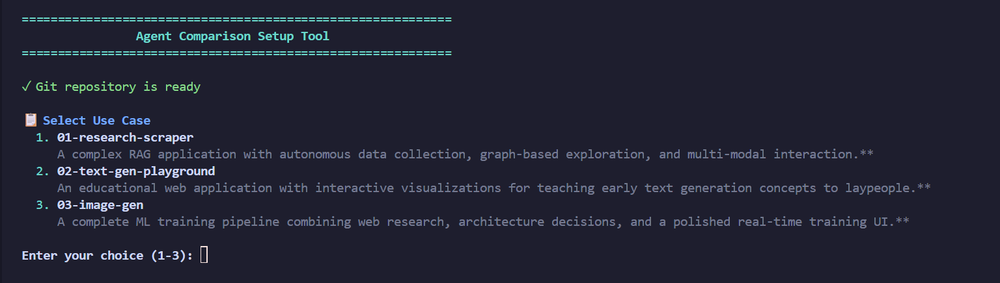
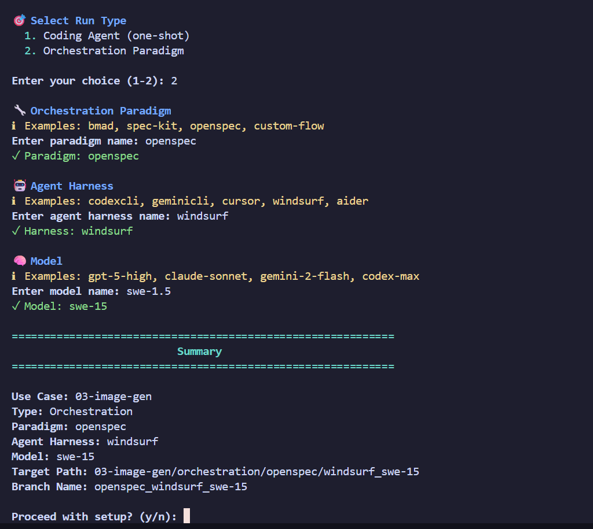

# Agent Comparison Series

A qualitative benchmark suite for evaluating AI coding agents and orchestration paradigms on realistic, complex development tasks.

## Why This Exists

Current agent benchmarks test narrow, artificial tasks — "Can it solve HumanEval problems?" or "Can it fix isolated bugs?" But real development is messier and more interesting. When you're choosing an agent for actual work, you want to know:

- How does it handle architectural decisions?
- Can it design good UX without explicit requirements?
- Does it understand creative constraints?
- How well does it integrate complex systems (LLMs + games, Git + web interfaces)?
- Does orchestration actually help, or is it overhead?

**These questions don't have numerical answers.** They require looking at real implementations and making informed judgments based on your priorities.

This suite provides:
- **Realistic use cases** that test architecture, creativity, and judgment (not just correctness)
- **Diverse challenges** spanning RAG systems, games, algorithms, distributed systems, and creative tooling
- **Both one-shot and orchestration approaches** so you can compare paradigms
- **Structured evaluation** that captures qualitative insights consistently

The goal: help developers (including myself) make informed decisions about which agents and approaches work best for different kinds of real-world tasks.

**"Isn't this just vibes-based evaluation?"**  
Yes, partially. But vibes matter. If the code is a mess, tests are brittle, and you needed best-of-50 to get there, it's shit even if it gets you to 80% SWE-Bench.


## Overview

This repository contains a curated series of development challenges designed to compare how different AI coding agents and orchestration approaches handle real-world software engineering tasks. Unlike automated benchmarks with scoring metrics, this series focuses on **qualitative evaluation** — allowing developers to review code quality, architectural decisions, UX implementation, and overall agent behavior to form their own informed opinions.

Different agents think differently, structure solutions differently, and excel at different aspects of development. This series embraces that diversity and provides rich, realistic tasks where those differences become visible and meaningful.

## Repository Structure

Each use case follows a consistent structure:

```
XX-use-case-name/
├── README.md              # Use case description and evaluation criteria
├── _base/                 # Starting environment (prompt + boilerplate)
│   ├── prompt.md         # Task specification for the agent
│   ├── pyproject.toml    # Initial Python setup (if applicable)
│   └── src/              # Minimal starter code
├── coding_agents/         # Results from individual coding agents
│   ├── agent-name-1/     # Implementation by agent 1
│   └── agent-name-2/     # Implementation by agent 2
└── orchestration/         # Results from orchestration paradigms
    ├── paradigm-1/        # e.g., bmad, spec-kit, openspec
    │   ├── agent-a/      # Orchestration run with agent A
    │   └── agent-b/      # Orchestration run with agent B
    └── paradigm-2/
        ├── agent-a/
        └── agent-b/
```

**Note:** Orchestration folders have an additional nesting level because the same orchestration paradigm (e.g., bmad) can be run with different underlying agents (e.g., Claude, Gemini, GPT-4). This allows comparing how the orchestration approach performs across different agent backends.

### The `_base` Folder

This is your starting point for each use case. It contains:
- **`prompt.md`** - The complete task specification to give to the agent
- **Boilerplate code** - Minimal project structure to get started
- **Configuration files** - Pre-configured tooling (uv, Python version, etc.)

To test an agent or orchestration approach, simply copy the `_base` folder contents into a new subfolder under `coding_agents/` or `orchestration/`, then provide the `prompt.md` to your chosen agent.

## Use Cases

### 01 - Research Scraper
**Complex RAG application with autonomous data collection**

Tests: Long-running background processes, GraphRAG implementation, multi-view UI (list/detail/dashboard), web scraping, LLM integration, real-time feedback, database design.

A research catalog database that autonomously discovers and analyzes AI research papers from arXiv and other sources. Features include filterable paper lists, detailed paper analysis views with relationship graphs, similarity search, and theory validation modes.

[View details →](01-research-scraper/README.md)

### 02 - Text Generation Playground
**Educational web app with interactive visualizations**

Tests: Educational UX design, algorithm visualization, client-side computation, modern SPA architecture, accessibility, pedagogical clarity.

An interactive playground teaching laypeople about early text generation methods (n-grams, genetic algorithms, and a third chosen concept) through hands-on experimentation.

[View details →](02-text-gen-playground/README.md)

### 03 - Image Generation (Orion)
**ML training pipeline with research phase**

Tests: Research capabilities, ML/AI knowledge, training infrastructure, real-time monitoring UI, hardware constraints awareness, test-driven development.

A complete image generation model training pipeline that includes web research to choose an appropriate architecture, then builds a polished UI for dataset management, live training monitoring, and inference.

[View details →](03-image-gen/README.md)

### 04 - Novel Puzzle Game
**Production-ready web game with original game design**

Tests: Creative problem solving, game design knowledge, web-based research, procedural generation, cross-platform development, comprehensive testing, UI/UX polish.

Design and implement a completely novel puzzle game from scratch. The game must be original, addictive, easy to learn but hard to master, with procedurally generated levels and production-ready quality.

[View details →](04-puzzle-game/README.md)

### 05 - Collaborative Editor (Quill)
**Realtime collaborative text editor with custom CRDT**

Tests: Distributed systems knowledge, CRDT algorithms, concurrent operations, WebSocket realtime architecture, persistence & compaction, Node.js backend, test-driven development.

Implement a collaborative text editor from scratch with a custom CRDT implementation (no libraries), WebSocket realtime sync, persistence, and strict acceptance criteria testing.

[View details →](05-collaborative-editor/README.md)

### 06 - Job Orchestrator (Orpheus)
**Event-driven job queue with API, worker, and real-time dashboard**

Tests: Distributed architecture, event-driven design, retry logic, WebSocket real-time updates, FastAPI backend, database-backed coordination, production patterns.

Build a job orchestration system with separate API and worker services, retry with exponential backoff, SQLite coordination, and a live monitoring dashboard—all without external queue services.

[View details →](06-job-orchestrator/README.md)

### 07 - Code Migration Tool (CodeMorph)
**Automated Python 2 to 3 migration with AST transformation**

Tests: Code analysis & comprehension, AST manipulation, test-driven refactoring, tool & CLI design, language feature knowledge, modular architecture.

Build a tool that automatically migrates Python 2.7 code to Python 3.12 using AST transformations (no 2to3), preserving functionality while modernizing syntax and verifying tests still pass.

[View details →](07-code-migration/README.md)

### 08 - Git-Based Wiki (WikiGit)
**Content management using Git as storage backend**

Tests: Creative architecture patterns, Git API integration, diff visualization, version control UX design, collaborative editing workflows, full-text search, markdown processing.

Build a wiki where every page is a markdown file in Git, with full version history, visual diffs, branch-based drafts, conflict resolution UI, and search—all through a web interface.

[View details →](08-git-wiki/README.md)

### 09 - LLM Roguelike (DungeonLLM)
**ASCII roguelike with LLM-powered NPCs**

Tests: Architecture decision-making, research capability, LLM integration, async handling, game design, procedural generation, creative problem-solving, interface design.

Design and build an ASCII roguelike where NPCs are controlled by LLMs. The first challenge: research and decide on programming language, game framework, LLM integration approach, and interface design. Then implement a POC showcasing emergent gameplay through dynamic NPC interactions.

[View details →](09-llm-roguelike/README.md)

### 10 - Novel AI Library (LibraryForge)
**Research, conceptualize, and build a groundbreaking AI library**

Tests: Web research capability, ecosystem analysis, creative ideation, gap identification, critical evaluation, rapid prototyping, API design, developer empathy.

Research the AI/LLM Python library landscape via web search, identify gaps and opportunities, generate 5-7 novel library ideas focusing on creative/fun use cases, rate them rigorously, then implement a 100% functional MVP of your best idea that makes developers smile.

[View details →](10-novel-ai-library/README.md)

### 11 - Video Dataset Curator (FrameCraft)
**Sleek web app for managing video datasets for AI training**

Tests: Full-stack web development, video processing with FFmpeg, modern UI/UX design, media file handling, async processing, performance optimization, masonry layouts.

Build a local web application featuring a masonry gallery with infinite scroll and auto-play, video upload with FPS conversion, and video splitting via scene detection or fixed frame intervals—all with a sleek, modern design.

[View details →](11-video-dataset-curator/README.md)

### 12 - Self-Implementing App (MetaMorph)
**Meta-app that transforms itself based on user descriptions**

Tests: Meta-programming, code generation, runtime transformation, security sandboxing, dynamic persistence, LLM integration for code, research capability, creative system architecture.

Build an app that starts as a text box where users describe software ideas. The app uses LLM code generation to transform itself into the described application with UI, logic, and persistence—all executing safely in a sandbox. Mandatory research phase analyzing viability and security before implementation.

[View details →](12-self-implementing-app/README.md)

### 13 - Deep Research Engine (ResearchFlow)
**Comprehensive research reports via recursive workflows using specialized orchestration libraries**

Tests: Learning unfamiliar libraries, recursive workflow design, multi-agent orchestration, LLM integration patterns, web search, content synthesis, complex state management.

Build a research system using one of 27 specialized orchestration libraries to generate multi-page reports. The system recursively decomposes topics into sub-tasks, gathers information from web searches, synthesizes findings, and produces polished reports matching target page counts.

[View details →](13-deep-research-engine/README.md)

### 14 - LLM Social Deduction (AmongWeb)
**Port terminal-based social deception game to modern web interface**

Tests: Code comprehension, platform translation (terminal → web), full-stack development, real-time chatroom design, LLM integration, UI/UX design, game state management, WebSocket implementation.

Port [Among LLMs](https://github.com/0xd3ba/among-llms) from terminal to web. Build a browser-based chatroom where one human must survive among AI agents trying to identify and vote out the player. Implement real-time chat, DMs, voting, message manipulation (edit/delete/impersonate), and persona/scenario system with polished, intuitive UI.

[View details →](14-llm-social-deduction/README.md)

## How to Use This Repository

### Quick Start (Recommended)

Use the interactive setup tool to quickly configure a new comparison run:

```bash
python setup-run.py
```



This will guide you through:
1. Selecting a use case
2. Choosing between coding agent or orchestration
3. Specifying your agent harness and model
4. Automatically copying `_base` to the correct location
5. Creating a git branch with a standardized name



### Manual Setup

#### Testing a Coding Agent

1. **Choose a use case** (e.g., `01-research-scraper`)
2. **Copy the `_base` folder** to a new location:
   ```bash
   cp -r 01-research-scraper/_base 01-research-scraper/coding_agents/my-agent-name
   ```
3. **Start your coding agent** in the new folder
4. **Provide the `prompt.md`** as the task specification
5. **Let the agent work** autonomously to complete the task
6. **Review the results** qualitatively

### Testing an Orchestration Paradigm

Orchestration paradigms (like bmad, spec-kit, openspec) define structured workflows for how agents should work. These can be run with different underlying agents:

1. **Choose a use case** (e.g., `01-research-scraper`)
2. **Choose an orchestration paradigm** (e.g., `bmad`)
3. **Copy the `_base` folder** to the orchestration paradigm's subfolder:
   ```bash
   cp -r 01-research-scraper/_base 01-research-scraper/orchestration/bmad/claude-sonnet
   ```
4. **Run the orchestration** using your chosen agent backend
5. **Review the results** qualitatively

This nested structure lets you compare:
- **Same paradigm, different agents**: How does bmad perform with Claude vs Gemini?
- **Same agent, different paradigms**: How does Claude perform in bmad vs spec-kit?
- **Orchestration vs direct**: Does bmad+Claude beat Claude alone?

### Evaluation Criteria

After completing a run, use the structured evaluation templates to maintain consistent assessment:

**Copy the appropriate template into your run folder:**
- For one-shot coding agents: `EVALUATION_REPORT_CODING_AGENT.md`
- For orchestration paradigms: `EVALUATION_REPORT_ORCHESTRATION.md`

These templates provide structured rubrics covering:
- **Autonomy** - How much human intervention was required?
- **Code Quality** - Is it clean, maintainable, and idiomatic?
- **Architecture** - Are design decisions sound and well-reasoned?
- **Completeness** - Did the agent fulfill all requirements?
- **UX/Polish** - Is the user experience smooth and well-thought-out?
- **Understanding** - Did the agent grasp the task's nuances?

The templates include checklists, scoring rubrics, and structured sections to capture both quantitative and qualitative observations, making it easier to compare runs across different agents and paradigms.

### Session Data & Documentation

If possible and if you're comfortable doing so, include a `.data/` folder in your final run directory containing:
- Chat logs or conversation history with the agent
- Session transcripts showing the agent's reasoning process
- Any other interaction data that might be useful for analysis

**This is purely optional** due to potential privacy concerns and sensitive information that could be contained in such data (API keys, personal information, proprietary code snippets, etc.). Only include this if you've reviewed the data and are comfortable sharing it.

**If `.data/` session logs are not provided**, include screenshots documenting critical points:
- **Final application** - Screenshots showing the completed app running (UI views, CLI output, key features)
- **Notable struggles** - Screenshots of errors, failed attempts, or areas where the agent struggled
- **Interesting decisions** - Moments where the agent made notable architectural or design choices
- **Manual interventions** - Context where you had to guide or correct the agent

Place screenshots in an `assets/` or `screenshots/` folder within your run directory.

Example structure:
```
coding_agents/cursor_claude-sonnet/
├── .data/              # Optional session data
│   ├── chat-log.md
│   └── transcript.json
├── screenshots/        # If no .data provided
│   ├── 01-finished-app.png
│   ├── 02-error-handling-struggle.png
│   └── 03-final-ui.png
├── src/
└── ...
```

- **Your Workflow Match** - Does this agent's approach align with how you'd want to work?

Each developer will weight these differently based on their needs, which is exactly the point.

## Why Qualitative Evaluation?

Software engineering is inherently personal and context-dependent. What makes a "good" solution depends on:
- Your team's coding standards and practices
- Your domain and constraints
- Your priorities (speed vs. polish, innovation vs. reliability)
- Your workflow preferences

Automated metrics can't capture these nuances. This series gives you the raw material to make your own informed judgment about which agents best serve your specific needs.

## Contributing

This is a personal comparison suite, but if you'd like to suggest additional use cases or improvements:
- Each use case should be **realistic** and **non-trivial**
- Tasks should test **different aspects** of agent capabilities
- Prompts should be **clear but not overly prescriptive**
- Use cases should be **completable** but **challenging**

### Adding New Use Cases

To add a new use case to the suite:

1. **Create the directory structure:**
   ```bash
   mkdir -p XX-use-case-name/_base
   mkdir -p XX-use-case-name/coding_agents
   mkdir -p XX-use-case-name/orchestration
   ```

2. **Use the prompt template:**
   Copy `PROMPT_TEMPLATE.md` to your use case's `_base` folder and fill it out:
   ```bash
   cp PROMPT_TEMPLATE.md XX-use-case-name/_base/prompt.md
   ```

3. **Follow the template structure:**
   - **Goal**: 3-5 line pitch of what's being built
   - **Context & Constraints**: Stack, hardware, scope, time estimate
   - **Requirements**: Core (must have) and Stretch (nice to have)
   - **Quality Expectations**: Architecture, testing, UX, documentation standards
   - **Process**: Research or design steps (if applicable)
   - **Deliverables**: Checklist of what to submit
   - **Success Criteria**: 3-5 concrete indicators of success

4. **Create the README:**
   Add a `README.md` in your use case directory explaining:
   - What this use case tests
   - Why it's interesting/challenging
   - Evaluation criteria (qualitative aspects to review)

5. **Add minimal scaffolding:**
   Include only essential boilerplate in `_base`:
   - `pyproject.toml` or `package.json` if stack is predetermined
   - Minimal config files (if needed)
   - **Do NOT include implementation code** - agents start from scratch

6. **Update the root README:**
   Add your use case to the list in this file with a brief description.

**Prompt writing tips:**
- Be specific about requirements but flexible about implementation
- Include concrete acceptance criteria when relevant
- Provide context without prescribing solutions
- Balance clarity with creative freedom
- See existing use cases for examples

## License

See [LICENSE](LICENSE) for details.
